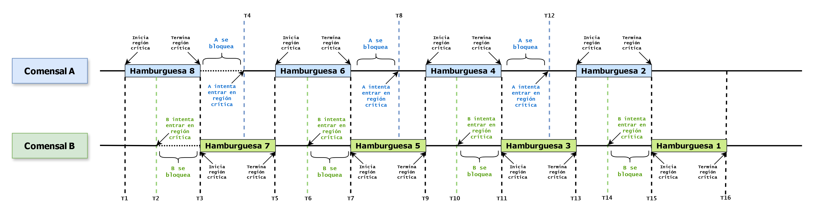

 

# Repositorio para la carrera [Tcnicatura Universitaria en Programación](https://www.frbb.utn.edu.ar/frbb/sacad/carreras/tup/) de la UTN
### **Alumno:**  [Lucio Mansilla Andreocci](https://github.com/LUCU0) 👨‍🎓
### **Materia:**  Arquitectura y Sistemas Operativos 💻
### **Profesores:**  Gustavo Ramoscelli y [Sergio Antozzi](https://github.com/santozzi) 👨‍🏫
#####

#  

<p align="center">
  

  
  
</p>


# Trabajo Practico N°1 ✅
## Instalación de Máquina Virtual / Linux / VisualStudioCode (VSCode)


### 📌 Tomar una captura de pantalla con VSCode y código python y subirla en la tarea del aula virtual.
- [Captura del código de python](https://github.com/LUCU0/ASO2024TPs/blob/main/TP1/Captura%20de%20pantalla_2024-05-13_18-41-50.png)
  ######
- **Código usado:** `print("Hola mundo")`

#
#####  
#####  
#####  

# Trabajo Practico N°2 ✅
## Generalidades Linux / Git (control de versiones) / GCC (GNU Colección de Compiladores)

### 📌 Crear el repositorio **ASO2024TPs**, ejecutar el archivo procesos.c y subir captura de pantalla de los procesos listados
- [Captura del listado de procesos](https://github.com/LUCU0/ASO2024TPs/blob/main/TP2/Captura%20de%20pantalla_2024-04-12_20-28-05.png)
- [Código que se ejecuto (archivo procesos.c)](TP2/procesos.c)

#
#####  
#####  
#####   


# Trabajo Practico N°3 ✅
## Hilos de ejecución

### 📍 PUNTO 1

- **📌 A) ¿Qué se puede notar con respecto al tiempo de ejecución? ¿Es predecible?**   
Lo que se puede notar entre una ejecución y otra del mismo archivo es una diferencia mínima en el tiempo, mientras que si se compara el tiempo de ejecución de un archivo y del otro se nota mucho la diferencia de tiempo entre una y otra.
No no es predecible ya que los dos archivos son distintos y la ejecución hace cosas diferentes.

- **📌 B) Comparar con un compañero el tiempo de ejecución. ¿Son iguales?**  
No son iguales debido a que puede haber una diferencia de hardware pero si son muy cercanos a los tiempos mios. Los tiempos fueron comparados con Gianluca zanconi.
   
#####   

|               |   Con hilos   |   Sin hilos   |         Imagenes Comparativas         |                 
| ------------- | ------------- | ------------- | ------------------------------------- |
|               |    4.08403    |    5.82521    |                                       |
|     Lucio     |    4.22170    |    5.96885    | [Con hilos](TP3/conhilos-captura.png) |
|    Mansilla   |    4.39649    |    5.80448    | [Sin hilos](TP3/sinhilos-captura.png) |
|               |    4.08193    |    5.70118    |                                       |
| ------------- | ------------- | ------------- | ------------------------------------- |
|               |    4.02625    |    5.16484    |                                       |
|    Gianluca   |    4.04216    |    5.16868    | [Con hilos](TP3/conhilos-otro.jpeg)   |
|    Zanconi    |    4.04913    |    5.18182    | [Sin hilos](TP3/sinhilos-otro.jpeg)   |
|               |    4.03406    |    5.19020    |                                       |
| ------------- | ------------- | ------------- | ------------------------------------- | 

#####  

- **📌 C) Ejecutar el archivo suma_rasta.py unas 10 veces, luego descomentar (borrar el #) las líneas 11,12,19 y 20 guardarlo y ejecutarlo otras 10 veces. ¿Qué pasó? ¿Por qué?**   
En mi caso lo que paso fue que al ajecutar las 10 veces el archivo con las lineas comentadas el valor final me daba 0 y solamente 3 veces me dio otros valores que fueron 280455, -219795 y -92720, con unos tiempos que variaban entre 0.01 y 0.06, y una sola vez salio con un pico de 0.26 segundos. Mientras que el archivo con las lineas descomentadas lo que mas cambio fueron los valores finales que no dieron 0 daban numeros negativos y positivos sin pasarce de los 500000 y los -500000, con los tiempos tambien fue un cambio grande, los tiempos fueron desde 8.6 a 11.14 segundos.
Esto sucede porque se le agrega un for y un pass.   
Lo que paso es que hay 2 hilos que modifican la misma variable global simultaneamente sin sincronizacion lo que proboca una race condition generando resultados impredecibles.

#####  
#  
#####  

### 📍 PUNTO 2

- **📌 A) Tu tarea será colocar las líneas de código en los lugares adecuados para poder resolver el problema de las hamburguesas de distribución equitativa.** 
**Se devera usar las siguientes líneas de codigo para resolver el problema:**

````c
// ** while(turno!=(int)tid);
// ** turno = (turno + 1)% NUMBER_OF_THREADS;
// ** int turno = 0;
// ** turno = (turno + 1)% NUMBER_OF_THREADS;
````

 🚨 👉  [**Código resuelto**](TP3/con_race_condition.c)  👈 🚨

#####  
#  
#####  

- **📌 B) Viendo la figura 2-22, como sería para el problema de las hamburguesas con 2 comensales y 8 hamburgesas.**
######


#
#####  
#####  
#####  

# Trabajo Practico N°4 ✅
## Docker compose - Servicios

### 📍 El práctico consiste en armar los servicios necesarios para una aplicación web básica y además, replicar parcialmente el sitio de la UTN-FRBB.
####
### 🚨 Subir las capturas de pantalla de: 
####
- 📌 **Mostrar con captura de pantalla la creación de los servicios y que los servicios están corriendo vía** ``docker-compose ps.``
#### 🖼️  [CAPTURA REALIZADA](TP4/docker_compose_ps.png)

####   
####   

- 📌 **Mostrar los sitio que crean los servicios phpmyadmin (http://localhost:8000/) y nginx (http://localhost/) con capturas de pantalla de un navegador web.**
#### 🖼️  [CAPTURA phpmyadmin](TP4/phpmyadmin.png)
#### 🖼️  [CAPTURA nginx](TP4/WebHTML.png)

####   
####   
####

- 📌 **Luego de clonar el sitio de la facultad, mostrar que está corriendo en forma local (http://localhost/) con capturas del navegador web. Y si se animan modifiquen algo.**
#### 🖼️  [CAPTURA Web UTN Clonada](TP4/webUTN.png)

#
#####  
#####  
#####  

# Trabajo Practico N°5 ✅
## Bash scripting

### 📍 Para el práctico final de la materia deben entregarse dos ejercicios: un ejercicio debe ser de la Parte I y un ejercicio debe ser de la parte II.
####
### 🚨 Se eligieron los siguientes ejercicios:
### - **Parte 1** - Adivina el Número: Escribe un script que genere un número aleatorio entre 1 y 100 y permita al usuario intentar adivinarlo, proporcionando pistas si el intento es demasiado alto o bajo.
### - **Parte 2** - Mostrar la edad probable de un nombre ingresado por el usuario, usando la API del sitio https://api.agify.io/?name=nombre .

####   
####   
### 🚨 Códigos:
### 👉 [Parte 1](TP5/parte1_1.sh)
####   
####   
### 👉 [Parte 2](TP5/Parte2_Edad.sh)

####    
####    
####    


